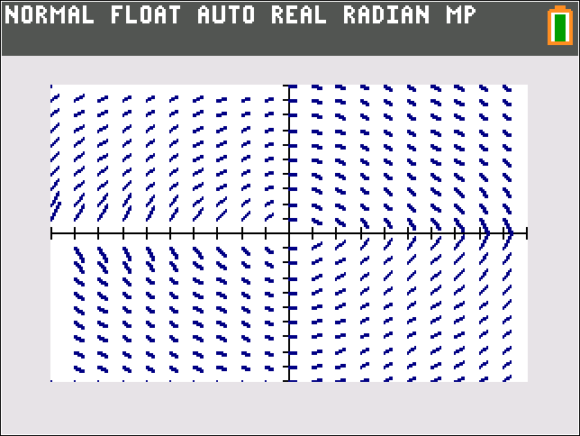
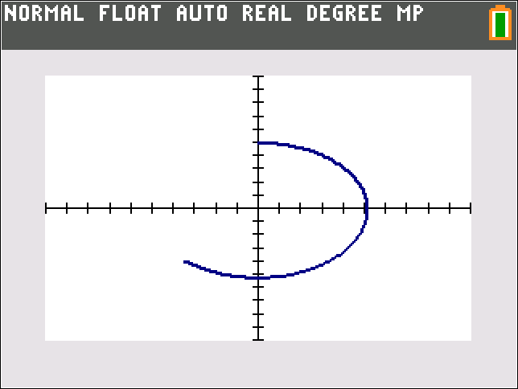

# APCalculus Programs
Archive of some useful programs written in TI-Basic for the TI-84 Plus CE

They are geared towards
- Fast and easy to use during test
- Things you actually need, by someone who takes Ap calc

## Legality
College board allows use of programmable calculators (like TI-84) and 97% of proctors will not request that you clear you memory before the test. 

## Conversion to older models
Have a Ti-83 or something else? Open the files as text and remove the last two arguments from every `line` command.

## Install
Get the corresponding computer software for your calc. For the TI84CE it is Ti Connect Ce.
Plug in your calculator and simply import the *.8xp files. There is no crap or setup when it comes to Texas Instruments

## Program Descriptions
### EULER
Euler method appoximation of curve through slope/vector field

**Prerequisites**: An expression in Y1 that computes SLOPE. Use `A` as a subsitute for Y.
Example: a circular slope field expression would be `-X/A`
Set your mode to `DEGREES`

**Params**: Initial X and Y coordinates

This will turn off graphing. ReEnable this at `VARS -> Y-Vars -> ON/OFF -> FnOn`

### FIELD
Displays a slope field 

**Prerequisites**: An expression in Y1 that computes SLOPE. Use `A` as a subsitute for Y.
Example: a circular slope field expression would be `-X/A`
Also set `window` to something like [-3,3] x [-3,3] or something small

This will turn off graphing. ReEnable this at `VARS -> Y-Vars -> ON/OFF -> FnOn`

### NEWTON
Finds the closest x value where the y value of the function is 0 (via newton's method)

**Prerequisites**: An expression with zeroes

**Params**: Guess is approximate x value

Will output each incremental x until |y(x)| < 1e-6

### ARC
Arc length finder for curves

**Prerequisites**: An expression with solvable arc length in Y1 (the first equation slot)

**Params**: L is for left bound; R is for right bound

### SURFACE
Surface area of function rotated about x-axis

**Prerequisites**: An expression with solvable surface area

**Params**: L is for left bound; R is for right bound

### AVG
Average Y value of function

**Prerequisites**: An expression with solvable average in Y1

**Params**: L is for left bound; R is for right bound

### MID
Approximates Integral via Midpoint Riemann summation

**Prerequisites**: An expression whose integral is regular

**Params**: L is for left bound; R is for right bound; N is rectangles to subdivide into

### TRAP
Approximates Integral via Trapezoidal Riemann summation

**Prerequisites**: An expression whose integral is regular

**Params**: L is for left bound; R is for right bound; N is rectangles to subdivide into

